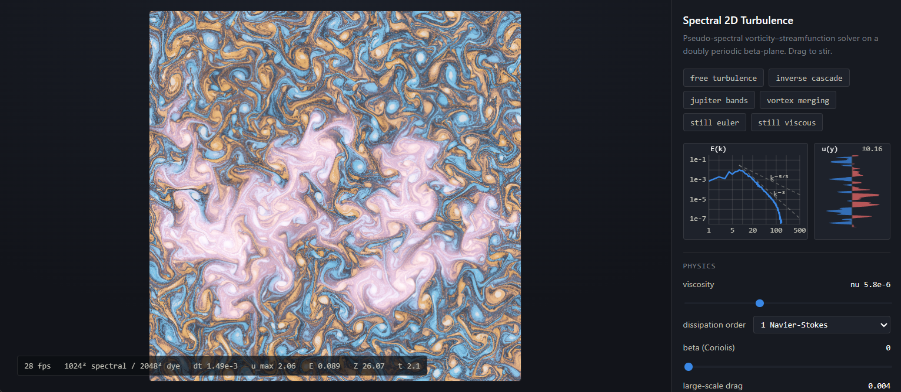

# Spectral 2D Turbulence



A real-time, interactive pseudo-spectral vorticity-streamfunction solver for 2D turbulence on a
doubly periodic beta-plane. Runs in the browser on WebGPU with a hand-written radix-4 FFT in WGSL.

Interactive fluid demos are usually built on Stam-style semi-Lagrangian advection, which is
strongly dissipative and destroys the small scales. A spectral solver at 256² to 512² instead
reproduces the actual 2D phenomenology: an inverse energy cascade, vortex merging, a `k^-3`
enstrophy range, and condensation into domain-scale vortices. With the beta term switched on,
zonal jets self-organise at the Rhines scale.

## Running

Plain ES modules with no build step, but it must be served over HTTP because modules and shader
files are fetched.

```
python -m http.server 8000
```

Open `http://localhost:8000/` and drag on the field to stir it.

Requires WebGPU: Chrome or Edge 113+, Firefox 141+ on Windows and 145+ on macOS, or Safari 26 on
Apple platforms. Firefox on Linux and Android is still pending.

## Using it

Drag to stir. Space pauses, `r` reseeds turbulence, `s` stills the fluid.

The panel exposes physics (viscosity, dissipation order, beta, large-scale drag), forcing
(stochastic amplitude, wavenumber and bandwidth, pointer strength and radius), integration (CFL,
maximum timestep, substeps per frame, grid, dye refinement) and display settings. Live plots show
the radial energy spectrum on log-log axes against `k^-3` and `k^-5/3` reference slopes, and the
zonal-mean velocity profile, where beta-plane jets are easiest to read.

### Presets

| Preset | Regime |
| --- | --- |
| `free turbulence` | unforced decay from a band-limited field |
| `inverse cascade` | forcing at high `k`, energy climbing to the domain scale |
| `jupiter bands` | beta switched on, zonal jets forming |
| `vortex merging` | large seeded vortices, weak damping |
| `still euler` | at rest, inviscid, perturbed only by dragging |
| `still viscous` | at rest, Navier-Stokes viscosity |

Starting from rest is the clearest way to see what the pointer does. A drag applies a Gaussian body
force, so what enters the vorticity equation is its curl: one horizontal stroke gives a clean
counter-rotating vortex dipole that then self-propels.

### Scenarios

The scenario buttons load classical initial conditions. Each is built as a vorticity field on the
physical grid, transformed, then masked into the dealiased band on the way in, since a tanh layer
or a sum of Gaussians carries energy at every wavenumber.

**shear layer** is the doubly periodic Kelvin-Helmholtz setup used as the Bell-Colella-Glaz
benchmark: two tanh shear layers with a sinusoidal perturbation, rolling into cat's-eye vortices.
Layer thickness scales with resolution so it stays resolved at 128². The roll-up stays sharp
instead of diffusing, which is the whole point of a spectral scheme.

**taylor-green** is `omega = 6 cos 2x cos 2y`. In 2D this case is special: `psi` is proportional to
`omega`, so the Jacobian vanishes identically and the field decays as exactly `exp(-nu |k|^2 t)`
without changing shape. The reference suite asserts both, the nonlinear term to 9e-16 and the decay
rate to 4e-14. At zero viscosity it holds its shape indefinitely, measured at 100.00 percent
enstrophy retention over 46 time units. The equilibrium is unstable, so stirring breaks the
symmetry and the vortex array collapses into larger vortices.

**dipole** is a counter-rotating Gaussian pair. It self-propels at `Gamma / (2 pi d)` and crosses
the periodic domain.

**merger** places two like-signed Gaussians of core radius 0.22 at an adjustable separation. Below
a critical separation they combine into a single vortex, above it they orbit indefinitely. Measured
on this implementation the threshold falls between 0.7 and 1.4, so roughly 3 to 6 core radii,
bracketing the classical value near 3.3.

**polygon** is Thomson's ring of co-rotating vortices, seeded with a 2 percent radial perturbation
so the instability has something to grow from. Six or fewer rotate rigidly, and the ring is
unstable from seven upward. Seven is marginal and distorts only slowly over many rotation periods,
which is why the slider labels it separately. By nine the ring breaks up within about seven periods
and the vortices pair off and merge.

## The scheme

State is the vorticity spectrum, with `omega = laplacian(psi)` so `psi_hat = -omega_hat / |k|^2`.
Each right-hand-side evaluation is:

1. `u_hat = i*ky*omega_hat/|k|^2`, `v_hat = -i*kx*omega_hat/|k|^2`, with the `k=0` mode zeroed.
2. Inverse transform `omega_hat + i*u_hat` to recover `omega` and `u` from one complex transform,
   and `v_hat` for `v`.
3. Forward transform `u*omega + i*(v*omega)`, unpack the two real spectra by Hermitian symmetry,
   and form `N_hat = i*kx*q1_hat + i*ky*q2_hat`.
4. Apply the 2/3 dealiasing mask.

Packing two real fields into each complex transform brings a right-hand-side evaluation down to
three transforms instead of five, so a full step costs nine transforms plus one for the forcing.

### The FFT kernel

Each workgroup transforms one line entirely in workgroup memory, so a pass touches global memory
once in each direction and needs no global ping-pong. The kernel is an in-place radix-4
decimation-in-time transform: every butterfly writes back to the four indices it read, and those
index sets partition the line, so one shared buffer suffices and no barrier is needed inside a
stage. Digit reversal is folded into the global-to-shared load as a one-time scatter, which is what
makes the in-place property possible and costs one permuted write rather than anything per stage.

The reversal is taken with respect to the radix list in the opposite order to the stages. Get that
backwards and the permutation is still bijective but no longer the right one. It is invisible at
pure powers of four, where the radix list is symmetric, and only shows up at sizes carrying a
trailing radix-2 stage: 128 and 512.

### Time integration

The linear operator is diagonal in `k`, so it is integrated exactly by an integrating factor:

```
L(k) = -mu - nu_h*|k|^(2p) + i*beta*kx/|k|^2
E(k, s) = exp(L*s)
```

The beta term sits inside that exponential, so Rossby waves propagate with no dispersion error and
impose no timestep restriction. Only the nonlinear term is advanced by RK3, in SSP form:

```
w1 = E(dt) * (w0 + dt*f0)
w2 = 3/4*E(dt/2)*w0 + 1/4*E(-dt/2)*(w1 + dt*f1)
w3 = 1/3*E(dt)*w0   + 2/3*E(dt/2)*(w2 + dt*f2)
```

The timestep is therefore limited purely by advective CFL. Maximum speed is reduced on the GPU and
the resulting `dt` left in a storage buffer that the kernels read directly, so no frame stalls on a
buffer map.

### Dissipation order

The dissipation term is `nu*(-laplacian)^p`, and the order `p` selects the physical model:

| Order | Term | Model |
| --- | --- | --- |
| 1 | `nu*laplacian(omega)` | Navier-Stokes |
| 2 | biharmonic | intermediate |
| 4 | `nu*(-laplacian)^4` | hyperviscous, the default |

Viscosity of exactly zero gives the Euler equations. Hyperviscosity is the default because it
confines dissipation to the smallest scales and keeps the inertial range clean at low resolution,
which is what makes the `k^-3` slope measurable at 256². Order 1 is the true Navier-Stokes
operator, and its `k^2` profile damps the mid-range too, so the whole field smooths rather than
only its finest scales.

The slider is parameterised as a damping rate at the dealiasing cutoff, `nu = rate / kcut^(2p)`,
and reports the resulting `nu`. That keeps the control resolution- and order-independent: the
useful range of `nu` itself spans about fourteen orders of magnitude between `p=1` and `p=4`, and
changing grid size would otherwise change the effective damping.

At exactly zero viscosity with no drag there is nothing to remove enstrophy, so it accumulates at
the grid scale and the field develops visible small-scale structure over time. This is the correct
behaviour of Euler on a finite grid, not an instability: the dealiased scheme conserves both
invariants, so it stays bounded. Measured over 14 seconds after an identical stir:

| | Energy retained | Enstrophy retained |
| --- | --- | --- |
| `still euler`, nu = 0 | 100.0% | 97.4% |
| `still viscous`, nu = 3.4e-4, order 1 | 95.5% | 74.7% |

Enstrophy decaying while energy barely moves is the 2D signature. Nudging viscosity just above zero
removes the grid-scale pile-up.

### Implementation notes

**The state must be dealias-masked at initialisation.** The Nyquist mode `k = -N/2` is
self-conjugate, so `u_hat = i*ky*omega_hat/|k|^2` is purely imaginary there and not Hermitian.
Taking the real part after the inverse transform then silently corrupts the field, and the packed
transforms and both conserved quantities go with it. Masking the initial condition puts the state
inside the dealiased band where this cannot occur. Enforced in both the reference solver and the
GPU seeding.

**Stochastic forcing carries an `N^2` factor.** It is injected directly into the unnormalised
spectral coefficients, where the physical amplitude is `N^2` times the Fourier coefficient. Pointer
forcing is built in physical space and transformed, so it picks the factor up for free.

**Dye rides a separate finer grid.** Spectral advection of a sharp tracer rings badly at gradients,
and the dye is passive, so it is advected by BFECC with a MacCormack limiter against the spectral
velocity field, at one or two times the solver resolution.

## Validation

f32 is fine for visuals and useless for diagnostics, so validation happens in two layers.

`reference/spectral2d.py` is a float64 NumPy solver implementing the identical scheme. It is both
ground truth for the shaders and the place to get real numbers.

```
python reference/spectral2d.py
```

| Check | Result |
| --- | --- |
| Packed nonlinear term vs direct evaluation | 4.5e-16 |
| Energy drift, 200 inviscid steps | 1.1e-10 |
| Enstrophy drift, 200 inviscid steps | 7.9e-10 |
| Energy drift, same with beta=12 | 5.3e-10 |
| Rossby phase error vs analytic | 4.4e-16 |
| Decaying turbulence E(k) slope | -3.21 |
| Beta-plane zonal anisotropy | 2.9 |

`reference/fft_ref.py` models the FFT kernel line for line in Python and checks it against
`numpy.fft` at every supported size, so butterfly, twiddle and digit-reversal bugs surface before
they reach a shader. It also asserts the reversal is a bijection, a weaker property than being the
right permutation and worth checking separately.

The GPU kernels are then checked against float64 fixtures in the browser. Regenerate the fixtures
with `python reference/make_fixtures.py`, then open `http://localhost:8000/tests/`.

| Check | Relative error |
| --- | --- |
| fft2 forward | 1.6e-7 |
| fft2 inverse | 1.9e-7 |
| Velocity packing | 6.5e-8 |
| Nonlinear assembly with dealiasing | 7.2e-8 |
| One integrating-factor RK3 step | 2.7e-5 |
| Twenty steps accumulated | 6.0e-4 |

## Performance

Measured on Intel Iris Xe integrated graphics (gen-12lp), Chrome, one substep per frame, with
vsync disabled so these are frame costs rather than refresh rate:

| Spectral grid | Dye grid | Uncapped | Frame cost |
| --- | --- | --- | --- |
| 256² | 512² | 502 fps | 1.99 ms |
| 512² | 1024² | 131 fps | 7.67 ms |
| 1024² | 1024² | 44 fps | 22.9 ms |

The first two are display-bound and hold 60 fps with headroom. 1024² is compute-bound and lands
near 40 fps, still interactive.

Workgroup storage bounds the grid size, since the FFT holds one line in it at `N*8` bytes. At
N=1024 that is 8 KB against a 16 KB default limit. N=2048 would need exactly 16384 bytes, which
validates, but would leave one workgroup in flight per compute unit, so the ceiling there is
occupancy rather than validation. Available sizes are computed from the adapter's reported limits
at startup rather than hardcoded, and the device is requested with those limits rather than the
defaults.

## Layout

```
index.html              app shell
styles.css
src/main.js             frame loop, config, presets
src/scenarios.js        classical initial conditions as physical-space vorticity fields
src/gpu/device.js       adapter and device acquisition
src/gpu/shaders.js      WGSL loading and constant substitution
src/gpu/pipeline.js     explicit bind group layouts
src/gpu/fft.js          FFT pipeline variants and dispatch
src/gpu/solver.js       resources and timestep encoding
src/gpu/render.js       presentation pass
src/shaders/            WGSL: fft, solver, force, reduce, dye, spectrum, render
src/ui/                 pointer, controls, diagnostic plots
reference/              float64 NumPy solver, FFT model, fixture generator
tests/                  browser harness comparing GPU kernels to fixtures
```

## Limits

WebGPU is f32 only. That is fine for visuals and adequate for the on-screen diagnostics, but the
spectrum bins and invariants accumulate in fixed point and should not be treated as measurements.
Use the NumPy reference for anything diagnostic.

The column pass of the FFT strides through the buffer rather than transposing. It trades coalescing
for halving the number of passes, which is the right call at these sizes but would not be at larger
ones.

In-place stages access shared memory with a stride that changes per stage, so the first stage,
where the stride is four complex values, takes bank conflicts that Stockham's more uniform access
pattern would avoid. That is the cost of halving workgroup storage, and at 1024² the extra
occupancy pays for it.

## References

Boffetta and Ecke, *Two-Dimensional Turbulence*, Annu. Rev. Fluid Mech. 44 (2012).
Rhines, *Waves and turbulence on a beta-plane*, J. Fluid Mech. 69 (1975).
Govindaraju et al., *High performance discrete Fourier transforms on graphics processors*, SC08.
